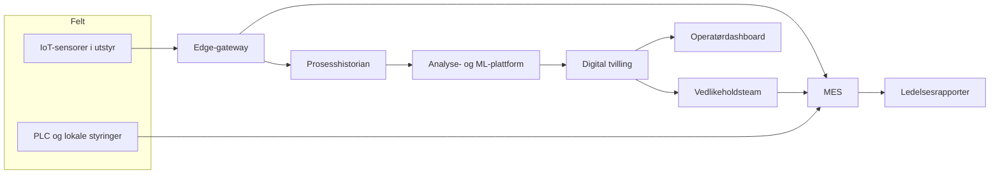
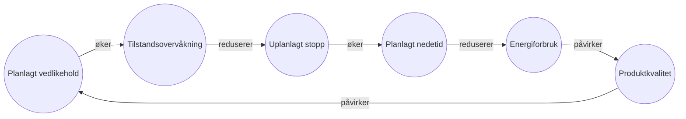

# Kapittel 2 – Systemtenkning og modellering

## Læringsmål

- Analysere komplekse systemer ved hjelp av systemtenkning.
- Vurdere ulike modelleringsstrategier for digitale tvillinger.
- Beskrive hvordan modeller kobles til måledata og styringssystemer.

## 2.1 Systemperspektiv

Systemtenkning starter med å forstå hvilke deler av virkeligheten som påvirker hverandre og hvordan verdistrømmer beveger seg gjennom systemet. Første steg er å definere klare systemgrenser, identifisere interessenter og beskrive hva de forsøker å oppnå. Deretter kan vi visualisere samspillet mellom teknologi, prosesser og mennesker ved hjelp av systemkart, påvirkningsdiagrammer og kausale sløyfer. Figurene under gir to typiske fremstillinger for en digital tvilling i en norsk industribedrift.

**Nøkkelspørsmål når systemperspektivet etableres:**

- Hvilke organisatoriske enheter og tekniske komponenter inngår i systemet?
- Hvilke datakilder, beslutninger og tilbakemeldingsløp knytter dem sammen?
- Hvilke målkonflikter kan oppstå mellom interessentene?

### Figur 2.1 – Systemkart for produksjonslinje med digital tvilling

Figuren illustrerer et typisk informasjonsløp der feltdata fra sensorer strømmer via en edge-gateway inn i produksjonsstyringssystemet. Historiske data kombineres med analyseplattformen for å oppdatere den digitale tvillingen, som igjen leverer beslutningsstøtte til operatører, vedlikeholdsteam og ledelsen. Når du lager et eget systemkart, noter eksplisitt hvilke datatyper som flyter mellom nodene, og marker hvor ansvar og eierskap ligger.

### Figur 2.2 – Kausalsløyfe mellom vedlikehold og energibruk

Kausalsløyfen viser hvordan systemkart kan brukes til å fange både ønskede og uønskede tilbakemeldinger. Økt planlagt vedlikehold forbedrer sensorenes status, som reduserer risiko for uplanlagte stopp. Lavere uplanlagt nedetid gir stabilt energiforbruk og høyere produktkvalitet, noe som igjen påvirker vedlikeholdsstrategien. Når slike forhold beskrives eksplisitt, blir det enklere å diskutere scenarier med interessenter og identifisere hvor den digitale tvillingen bør levere mest verdi.

**Arbeidsmåte for å utvikle systemkart:**

1. Start med en workshop hvor interessenter beskriver mål og smertepunkter.
2. Tegn det overordnede systemkartet (som i Figur 2.1) med fokus på dataflyt og ansvar.
3. Utvid kartet med kausale sløyfer (som i Figur 2.2) for å avdekke dynamikk og mulige ubalanser.
4. Forankre kartene i virksomhetens enterprise-arkitektur og eksisterende prosesskart slik at språk og symboler er gjenkjennelige for organisasjonen.

Den konseptuelle modellen fra systemkartet danner grunnlaget for videre modellering, enten du velger fysikkbaserte, datadrevne eller hybride tilnærminger i de følgende seksjonene.

## 2.2 Modelleringsparadigmer

- Fysikkbaserte modeller (differensialligninger, FEM, CFD).
- Datadrevne modeller (maskinlæring, statistikk, digitale skygger).
- Hybride modeller og ko-simulering.

## 2.3 Modellintegrasjon og kalibrering

- Hvordan koble modeller til sanntidsdata.
- Parameteridentifikasjon og kalibreringsmetoder.
- Modellreduksjon og modularisering.

## 2.4 Refleksjonsspørsmål og øvinger

1. Lag et systemkart for en valgt industriell prosess.
2. Diskuter fordeler og ulemper ved å kombinere fysikkbaserte og datadrevne modeller.
3. Beskriv hvordan du ville gjennomføre kalibrering av en modell som drifter over tid.
